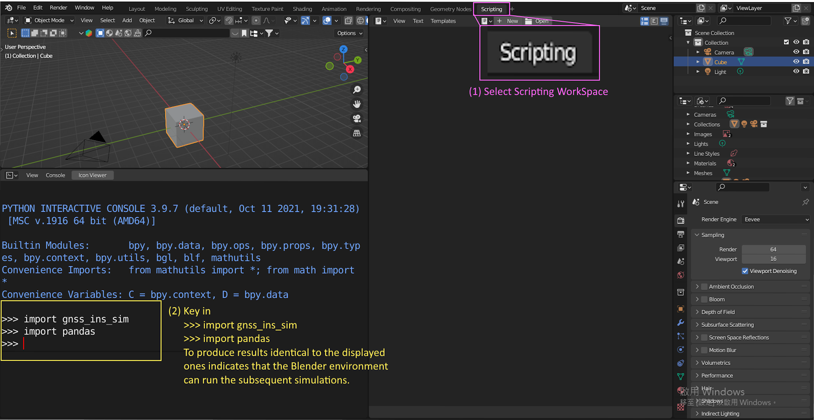

# IMUSimBlender
A Blender add-on for simulating and visualizing IMU data.

## Step 1: Setting Up Blender Environment

1. **Extract Blender Archive:**
   - Navigate to the `Blender_v3.0stable_WithCUDA_addSC2Fisheye_202201251123` directory.
   - Extract the `Release.7z` archive directly into the `Blender_v3.0stable_WithCUDA_addSC2Fisheye_202201251123` directory.

2. **Verify Blender Setup:**
   - Ensure that `Blender_v3.0stable_WithCUDA_addSC2Fisheye_202201251123/Release/blender.exe` can run properly.
   - Ensure that the `gnss-ins-sim` and `pandas` packages are installed.
   -   

## Step 2: Running the Simulation

1. **Open Blender:**
   - Go to `Blender_v3.0stable_WithCUDA_addSC2Fisheye_202201251123\Release\blender.exe` and run it.

2. **Load the Blender Model:**
   - Open the Blender model located in `Blender_Scene/RenderCamImgAccordingToCameraTrajectoryAtTxtFile_fisheye.blend`.

3. **Register Panel:**
   -   

3. **Check Configuration:**
   - Ensure that `config.ini` and other necessary configuration files are correctly set up.

4. **Adjust Scene and Parameters:**
   - Make any necessary adjustments to the scene and simulation parameters as required.

## Additional Tools

- **Merge Video Tool:**
  - Located in the `merge_video_tool` directory, containing `ffmpeg.exe` and `merge_video.py`.
- **SISEffectDemo:**
  - Includes raw and processed video files for the SIS effect demonstration.

## Verification

- **VerifyGroundTrustIMUData:**
  - Contains data files (`Acc.csv`, `Gyro.csv`, `Mag.csv`, `Quat.csv`) and Python scripts for verification.

For further assistance, feel free to reach out.
