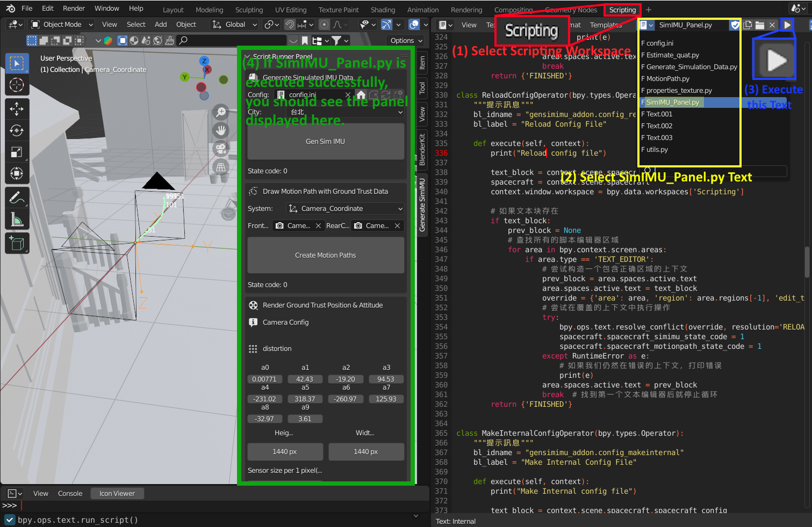

# IMUSimBlender
A Blender add-on for simulating and visualizing IMU data.

## Step 1: Setting Up Blender Environment

1. **Extract Blender Archive:**
   - Navigate to the `Blender_v3.0stable_WithCUDA_addSC2Fisheye_202201251123` directory.
   - Extract the `Release.7z` archive directly into the `Blender_v3.0stable_WithCUDA_addSC2Fisheye_202201251123` directory.

2. **Verify Blender Setup:**
   - Ensure that `Blender_v3.0stable_WithCUDA_addSC2Fisheye_202201251123/Release/blender.exe` can run properly.
   - Ensure that the `gnss-ins-sim` and `pandas` packages are installed.
   -   

## Step 2: Running the Simulation

1. **Open Blender:**
   - Go to `Blender_v3.0stable_WithCUDA_addSC2Fisheye_202201251123\Release\blender.exe` and run it.

2. **Load the Blender Model:**
   - Open the Blender model located in `Blender_Scene/RenderCamImgAccordingToCameraTrajectoryAtTxtFile_fisheye.blend`.

3. **Open Toggle System Console:**
   - In Blender, open the system console by navigating to `Window > Toggle System Console`.
   -   

4. **Register Instance Panel:**
   - To register the panel by navigating to `Scripting > SimIMU_Panel.py`, first run the `SimIMU_Panel.py` script.
   - After running the script, you will find the Script Runner Panel in the right sidebar of the 3D viewport.
   -   

5. **Generate IMU Data:**
   - Pressing the `home` button will navigate the document to `config.ini`.
   - Pressing `Gen Sim IMU` will generate simulation data in the `Output_S` directory.
   - 
   - Descriptions of other buttons and the fail-safe mechanism.   
   - 

6. **Create Motion Paths:**
   - Set up the pose animation and plot the path using the generated `/Blender_Scene/Output_S/Resample_blender.csv`.
   - 

7. **Interval Render Animation:**
   - Execute `Interval Render Animation` to render images from both camera into `/Blender Scene/RenderedImages`.
   - 

## Additional Tools

- **Merge Video Tool:**
  - Copy `ffmpeg.exe` and `merge_video.py` from the `merge_video_tool` directory to `/Blender_Scene/RenderedImages`.
  - Open the Command Prompt (cmd).
  - Change directory to `/Blender_Scene/RenderedImages`:
     ```cmd
     cd [your folder path]\Blender_Scene\RenderedImages
     ```
  - Run the following commands to create videos from the rendered images at 30 frames per second:
     ```cmd
     ffmpeg -y -framerate 30 -i Camera_Front_%d.jpg -c:v mpeg4 -q:v 5 Camera_Front.avi
     ffmpeg -y -framerate 30 -i Camera_Rear_%d.jpg -c:v mpeg4 -q:v 5 Camera_Rear.avi
     ```
  - First, ensure that Python is installed on your system and that OpenCV for Python is also installed. If both are installed, run the following command in cmd:
    ```cmd
    python merge_video.py
    ```
  
## Verification

- **VerifyGroundTrustIMUData:**
  - Contains data files (`/VerifyGroundTrustIMUData/Acc.csv`, `/VerifyGroundTrustIMUData/Gyro.csv`, `/VerifyGroundTrustIMUData/Mag.csv`, `/VerifyGroundTrustIMUData/Quat.csv`) generated from IMUSimBlender's virtual IMU data, and Python scripts (`/VerifyGroundTrustIMUData/FilterCompare.py`) for verification.

## Attachments

- **SISEffectDemo:**
  - `/SISEffectDemo` includes raw and processed video files for the SIS effect demonstration.

For further assistance, feel free to reach out.
